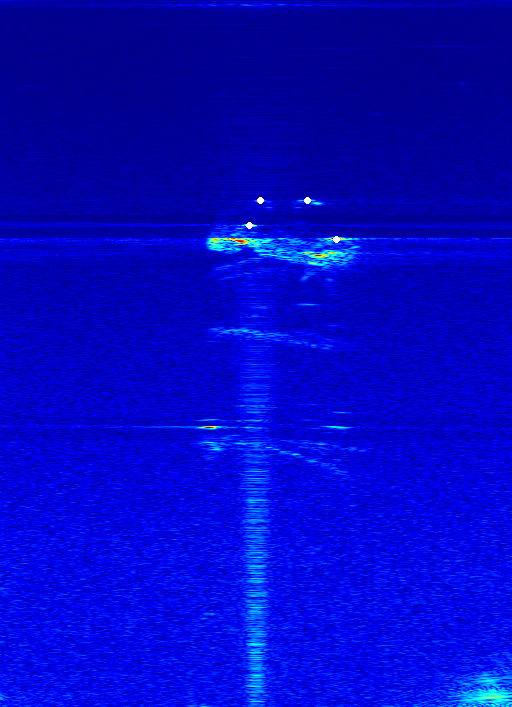

# Sonar extrinsics calibration

>zh_CN [简体中文](./readme/README.zh_CN.md) 

## Introduction

This project is a thesis named Lambertian-TRF: Lambertian Tensorial Radiation Fields for 3D Reconstruction Using Under Water Imaging Sonar. ([IEEE Transactions on Instrumentation & Measurement](https://www2.cloud.editorialmanager.com/Tim/default2.aspx)).

There are four reflective spheres on the calibration board, and the motion capture system can obtain the attitudes of these four spheres. Similarly, the sonar image can clearly distinguish the four reflecting balls on the calibration board. Based on the transformation relationship between sonar image and motion capture system, we solve the transformation matrix between Body coordinate system $\mathcal{F}_{B}$ and sonar coordinate system $\mathcal{F}_{S}$.

## Procedure

1. Put the calibration board in a pool equipped with a dynamic capture system to ensure that the calibration board can be observed by both the passive capture system and sonar.
2. Based on the ros system, ROS nodes are called to collect image data including GroundTruth and sonar.
3. Rosbag data is preprocessed by using rospy library, and sonar rawImage and pose information are extracted and saved in motionCaptureData.pkl file, which is in [preprocessfinal.py](../src/preprocessfinal.py).
4. Based on the preprocessed image data, manually find the reflective ball on the corresponding calibration board and save the position information of the reflective ball on the image to the file markerCoordData.pkl, which is in [getsonarimagecode.py](../src/getsonarimagecode.py).
5. Based on the position transformation relationship between the reflective ball in sonar image and the reflective ball in moving capture system, the transformation matrix is solved numerically by least square optimization, which is in [MultiimageCalibration.py](../src/MultiimageCalibration.py).
6. According to the obtained transformation matrix, the re-projection verification is carried out.

> The collected data is stored on [Google Cloud Disk](https://drive.google.com/file/d/1LjyENhdwCi62JH226Mk2wNh8gRYH6XEl/view?usp=sharing).